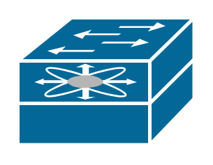

# Fibre Channel Fabric Switch

## Definition

```
{
  _style: 'shape=mxgraph.cisco.switches.fibre_channel_fabric_switch;sketch=0;html=1;pointerEvents=1;dashed=0;fillColor=#036897;strokeColor=#ffffff;strokeWidth=2;verticalLabelPosition=bottom;verticalAlign=top;align=center;outlineConnect=0;',
  _width: 101,
  _height: 74,
}
```

## Usage

```
import { FibreChannelFabricSwitch } from '@diac/standard-components-diagrams/ciscoSwitches'

<FibreChannelFabricSwitch/>
```

## Preview


