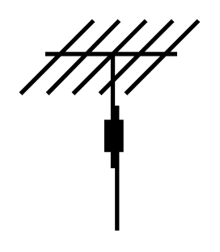

# Antenna

## Definition

```
{
  _style: { 
    entity: 'shape=mxgraph.cisco.wireless.antenna;sketch=0;html=1;pointerEvents=1;dashed=0;fillColor=#036897;strokeColor=#ffffff;strokeWidth=2;verticalLabelPosition=bottom;verticalAlign=top;align=center;outlineConnect=0;',
  },
  _original_width: 88,
  _original_height: 104,
}
```

## Usage

```
import { Antenna } from '@diac/standard-components-diagrams/ciscoWireless'

<Antenna/>
```

## Preview


