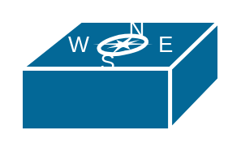

# Wireless Location Appliance

## Definition

```
{
  _style: 'shape=mxgraph.cisco.wireless.wireless_location_appliance;sketch=0;html=1;pointerEvents=1;dashed=0;fillColor=#036897;strokeColor=#ffffff;strokeWidth=2;verticalLabelPosition=bottom;verticalAlign=top;align=center;outlineConnect=0;',
  _width: 98,
  _height: 54,
}
```

## Usage

```
import { WirelessLocationAppliance } from '@diac/standard-components-diagrams/ciscoWireless'

<WirelessLocationAppliance/>
```

## Preview


