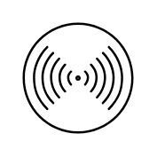
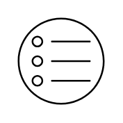

# Citrix Authentication Entities

- [AuthenticationAdaptive](./authentication-adaptive.md)  

- [AuthenticationCert](./authentication-cert.md)  

- [AuthenticationEpa](./authentication-epa.md)  

- [AuthenticationFailure](./authentication-failure.md)  

- [AuthenticationFido2](./authentication-fido2.md)  

- [AuthenticationGoogle](./authentication-google.md)  

- [AuthenticationMfa](./authentication-mfa.md)  

- [AuthenticationMsEntraId](./authentication-ms-entra-id.md)  

- [AuthenticationOidc](./authentication-oidc.md)  

- [AuthenticationOkta](./authentication-okta.md)  

- [AuthenticationPush](./authentication-push.md)  

- [AuthenticationRadius](./authentication-radius.md)  

- [AuthenticationSaml](./authentication-saml.md)  

- [AuthenticationSelection](./authentication-selection.md)  

- [AuthenticationTotp](./authentication-totp.md)  

- [Ldap](./ldap.md)  

