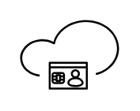
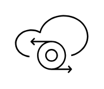

# Citrix Cloud Services Entities

- [CitrixAnalytics](./citrix-analytics.md)  

- [CitrixCloud](./citrix-cloud.md)  

- [CitrixCloudApi](./citrix-cloud-api.md)  

- [CitrixCloudStudio](./citrix-cloud-studio.md)  

- [CitrixFederatedAuthenticationService](./citrix-federated-authentication-service.md)  

- [CitrixGatewayService](./citrix-gateway-service.md)  

- [CloudConnector](./cloud-connector.md)  

- [CloudStorefront](./cloud-storefront.md)  

- [Daas](./daas.md)  

- [DaasMonitor](./daas-monitor.md)  

- [DevicePostureService](./device-posture-service.md)  

- [EndpointManagement](./endpoint-management.md)  

- [GlobalAppConfigurationService](./global-app-configuration-service.md)  

- [ItsmAdapterForServicenow](./itsm-adapter-for-servicenow.md)  

- [NetscalerConsole](./netscaler-console.md)  

- [NetscalerItm](./netscaler-itm.md)  

- [RemoteBrowserIsolation](./remote-browser-isolation.md)  

- [SecurePrivateAccess](./secure-private-access.md)  

- [SessionRecordingService](./session-recording-service.md)  

- [VdaUpgradeService](./vda-upgrade-service.md)  

- [WorkspaceEnvironmentManagement](./workspace-environment-management.md)  

