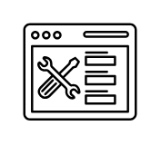

# Studio / Web Studio

## Definition

```
{
  _style: 'sketch=0;verticalLabelPosition=bottom;sketch=0;aspect=fixed;html=1;verticalAlign=top;strokeColor=none;fillColor=#000000;align=center;outlineConnect=0;pointerEvents=1;shape=mxgraph.citrix2.studio_web_studio;',
  _width: 50,
  _height: 42.985,
}
```

## Usage

```
import { StudioWebStudio } from '@reactiac/standard-components-diagrams/citrixComponents'

<StudioWebStudio/>
```

## Preview


