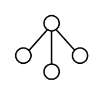

# Zones

## Definition

```
{
  _style: 'sketch=0;verticalLabelPosition=bottom;sketch=0;aspect=fixed;html=1;verticalAlign=top;strokeColor=none;fillColor=#000000;align=center;outlineConnect=0;pointerEvents=1;shape=mxgraph.citrix2.zones;',
  _width: 50,
  _height: 44.47,
}
```

## Usage

```
import { Zones } from '@diac/standard-components-diagrams/citrixComponents'

<Zones/>
```

## Preview


