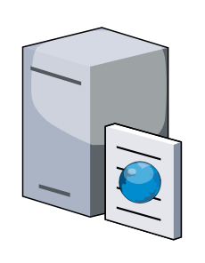

# Cache Server

## Definition

```
{
  _style: { 
    entity: 'verticalLabelPosition=bottom;sketch=0;aspect=fixed;html=1;verticalAlign=top;strokeColor=none;align=center;outlineConnect=0;shape=mxgraph.citrix.cache_server;',
  },
  _width: 71,
  _height: 97.5,
}
```

## Usage

```
import { CacheServer } from '@diac/standard-components-diagrams/citrixLegacy'

<CacheServer/>
```

## Preview


