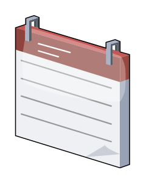

# Calendar

## Definition

```
{
  _style: { 
    entity: 'verticalLabelPosition=bottom;sketch=0;aspect=fixed;html=1;verticalAlign=top;strokeColor=none;align=center;outlineConnect=0;shape=mxgraph.citrix.calendar;',
  },
  _original_width: 75,
  _original_height: 100,
}
```

## Usage

```
import { Calendar } from '@dinghy/standard-components-diagrams/citrixLegacy'

<Calendar/>
```

## Preview


