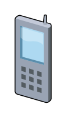

# Cell Phone

## Definition

```
{
  _style: 'verticalLabelPosition=bottom;sketch=0;aspect=fixed;html=1;verticalAlign=top;strokeColor=none;align=center;outlineConnect=0;shape=mxgraph.citrix.cell_phone;',
  _width: 25,
  _height: 60,
}
```

## Usage

```
import { CellPhone } from '@diac/standard-components-diagrams/citrixLegacy'

<CellPhone/>
```

## Preview


