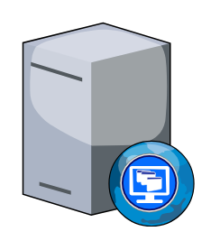

# Desktop Web

## Definition

```
{
  _style: 'verticalLabelPosition=bottom;sketch=0;aspect=fixed;html=1;verticalAlign=top;strokeColor=none;align=center;outlineConnect=0;shape=mxgraph.citrix.desktop_web;',
  _width: 76.5,
  _height: 90,
}
```

## Usage

```
import { DesktopWeb } from '@reactiac/standard-components-diagrams/citrixLegacy'

<DesktopWeb/>
```

## Preview


