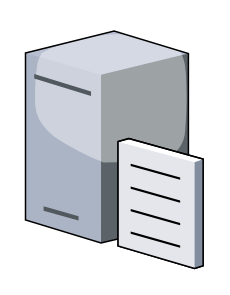

# File Server

## Definition

```
{
  _style: { 
    entity: 'verticalLabelPosition=bottom;sketch=0;aspect=fixed;html=1;verticalAlign=top;strokeColor=none;align=center;outlineConnect=0;shape=mxgraph.citrix.file_server;',
  },
  _width: 71,
  _height: 97,
}
```

## Usage

```
import { FileServer } from '@diac/standard-components-diagrams/citrixLegacy'

<FileServer/>
```

## Preview


