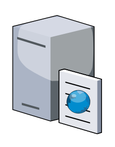

# FTP Server

## Definition

```
{
  _style: { 
    entity: 'verticalLabelPosition=bottom;sketch=0;aspect=fixed;html=1;verticalAlign=top;strokeColor=none;align=center;outlineConnect=0;shape=mxgraph.citrix.ftp_server;',
  },
  _original_width: 71,
  _original_height: 97,
}
```

## Usage

```
import { FtpServer } from '@diac/standard-components-diagrams/citrixLegacy'

<FtpServer/>
```

## Preview


