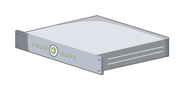
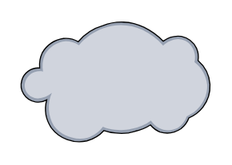
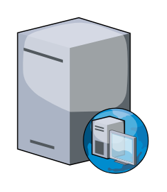
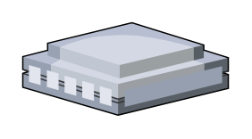
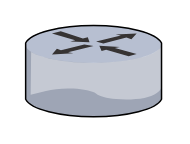
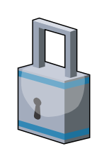

# Citrix (legacy) Entities

- [Component1u2uServer](./component-1u-2u-server.md)  

- [AccessCard](./access-card.md)  

- [BranchRepeater](./branch-repeater.md)  

- [Browser](./browser.md)  

- [CacheServer](./cache-server.md)  

- [Calendar](./calendar.md)  

- [CellPhone](./cell-phone.md)  

- [Chassis](./chassis.md)  

- [CitrixHdx](./citrix-hdx.md)  

- [CitrixLogo](./citrix-logo.md)  

- [Cloud](./cloud.md)  

- [CommandCenter](./command-center.md)  

- [Database](./database.md)  

- [DatabaseServer](./database-server.md)  

- [Datacenter](./datacenter.md)  

- [Desktop](./desktop.md)  

- [DesktopWeb](./desktop-web.md)  

- [DhcpServer](./dhcp-server.md)  

- [DirectoryServer](./directory-server.md)  

- [DnsServer](./dns-server.md)  

- [Document](./document.md)  

- [EdgesightServer](./edgesight-server.md)  

- [FileServer](./file-server.md)  

- [Firewall](./firewall.md)  

- [FtpServer](./ftp-server.md)  

- [GeolocationDatabase](./geolocation-database.md)  

- [Globe](./globe.md)  

- [GotoMeeting](./goto-meeting.md)  

- [Government](./government.md)  

- [HomeOffice](./home-office.md)  

- [HqEnterprise](./hq-enterprise.md)  

- [Inspection](./inspection.md)  

- [IpPhone](./ip-phone.md)  

- [Kiosk](./kiosk.md)  

- [Laptop](./laptop.md)  

- [Laptop2](./laptop-2.md)  

- [LicenseServer](./license-server.md)  

- [MerchandisingServer](./merchandising-server.md)  

- [Middleware](./middleware.md)  

- [NetscalerGateway](./netscaler-gateway.md)  

- [NetscalerMpx](./netscaler-mpx.md)  

- [NetscalerSdx](./netscaler-sdx.md)  

- [NetscalerVpx](./netscaler-vpx.md)  

- [PbxServer](./pbx-server.md)  

- [Pda](./pda.md)  

- [Podio](./podio.md)  

- [Printer](./printer.md)  

- [Process](./process.md)  

- [ProvisioningServer](./provisioning-server.md)  

- [ProxyServer](./proxy-server.md)  

- [RadiusServer](./radius-server.md)  

- [RemoteOffice](./remote-office.md)  

- [Reporting](./reporting.md)  

- [RoleAppcontroller](./role-appcontroller.md)  

- [RoleApplications](./role-applications.md)  

- [RoleCloudbridge](./role-cloudbridge.md)  

- [RoleDesktops](./role-desktops.md)  

- [RoleLoadTestingController](./role-load-testing-controller.md)  

- [RoleLoadTestingLauncher](./role-load-testing-launcher.md)  

- [RoleReceiver](./role-receiver.md)  

- [RoleRepeater](./role-repeater.md)  

- [RoleSecureAccess](./role-secure-access.md)  

- [RoleSecurity](./role-security.md)  

- [RoleServices](./role-services.md)  

- [RoleStorefront](./role-storefront.md)  

- [RoleStorefrontServices](./role-storefront-services.md)  

- [RoleSynchronizer](./role-synchronizer.md)  

- [RoleXenmobile](./role-xenmobile.md)  

- [RoleXenmobileDeviceManager](./role-xenmobile-device-manager.md)  

- [Router](./router.md)  

- [Security](./security.md)  

- [Sharefile](./sharefile.md)  

- [Site](./site.md)  

- [SmtpServer](./smtp-server.md)  

- [StorefrontServices](./storefront-services.md)  

- [Switch](./switch.md)  

- [Tablet](./tablet.md)  

- [Tablet2](./tablet-2.md)  

- [ThinClient](./thin-client.md)  

- [TowerServer](./tower-server.md)  

- [UserControl](./user-control.md)  

- [Users](./users.md)  

- [WebServer](./web-server.md)  

- [WebService](./web-service.md)  

- [Worxenroll](./worxenroll.md)  

- [Worxhome](./worxhome.md)  

- [Worxmail](./worxmail.md)  

- [Worxweb](./worxweb.md)  

- [XenappServer](./xenapp-server.md)  

- [XenappServices](./xenapp-services.md)  

- [XenappWeb](./xenapp-web.md)  

- [Xencenter](./xencenter.md)  

- [Xenclient](./xenclient.md)  

- [XenclientSynchronizer](./xenclient-synchronizer.md)  

- [XendesktopServer](./xendesktop-server.md)  

- [Xenmobile](./xenmobile.md)  

- [Xenserver](./xenserver.md)  

