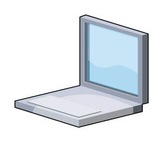

# Laptop

## Definition

```
{
  _style: { 
    entity: 'verticalLabelPosition=bottom;sketch=0;aspect=fixed;html=1;verticalAlign=top;strokeColor=none;align=center;outlineConnect=0;shape=mxgraph.citrix.laptop_1;',
  },
  _original_width: 91,
  _original_height: 77,
}
```

## Usage

```
import { Laptop } from '@dinghy/standard-components-diagrams/citrixLegacy'

<Laptop/>
```

## Preview


