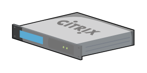

# NetScaler MPX

## Definition

```
{
  _style: { 
    entity: 'verticalLabelPosition=bottom;sketch=0;aspect=fixed;html=1;verticalAlign=top;strokeColor=none;align=center;outlineConnect=0;shape=mxgraph.citrix.netscaler_mpx;',
  },
  _width: 100,
  _height: 39,
}
```

## Usage

```
import { NetscalerMpx } from '@diac/standard-components-diagrams/citrixLegacy'

<NetscalerMpx/>
```

## Preview


