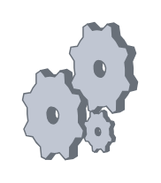

# Process

## Definition

```
{
  _style: 'verticalLabelPosition=bottom;sketch=0;aspect=fixed;html=1;verticalAlign=top;strokeColor=none;align=center;outlineConnect=0;shape=mxgraph.citrix.process;',
  _width: 52,
  _height: 62,
}
```

## Usage

```
import { Process } from '@reactiac/standard-components-diagrams/citrixLegacy'

<Process/>
```

## Preview


