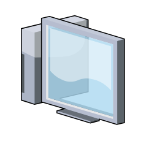

# Thin Client

## Definition

```
{
  _style: 'verticalLabelPosition=bottom;sketch=0;aspect=fixed;html=1;verticalAlign=top;strokeColor=none;align=center;outlineConnect=0;shape=mxgraph.citrix.thin_client;',
  _width: 71,
  _height: 71,
}
```

## Usage

```
import { ThinClient } from '@reactiac/standard-components-diagrams/citrixLegacy'

<ThinClient/>
```

## Preview


