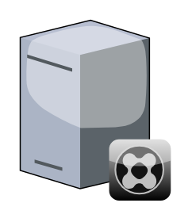

# XenClient Synchronizer

## Definition

```
{
  _style: { 
    entity: 'verticalLabelPosition=bottom;sketch=0;aspect=fixed;html=1;verticalAlign=top;strokeColor=none;align=center;outlineConnect=0;shape=mxgraph.citrix.xenclient_synchronizer;fillColor=#CCCCCC;gradientColor=#000000;gradientDirection=south;',
  },
  _original_width: 76,
  _original_height: 91,
}
```

## Usage

```
import { XenclientSynchronizer } from '@diac/standard-components-diagrams/citrixLegacy'

<XenclientSynchronizer/>
```

## Preview


