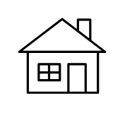
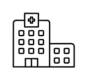
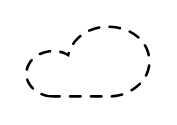

# Citrix Locations Entities

- [Airport](./airport.md)  

- [Cloud](./cloud.md)  

- [DataCenter](./data-center.md)  

- [Factory](./factory.md)  

- [FinanceGovernment](./finance-government.md)  

- [Home](./home.md)  

- [Hospital](./hospital.md)  

- [HybridCloud](./hybrid-cloud.md)  

- [Office](./office.md)  

- [PrivateCloud](./private-cloud.md)  

