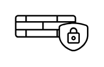

# WAF

## Definition

```
{
  _style: { 
    entity: 'sketch=0;verticalLabelPosition=bottom;sketch=0;aspect=fixed;html=1;verticalAlign=top;strokeColor=none;fillColor=#000000;align=center;outlineConnect=0;pointerEvents=1;shape=mxgraph.citrix2.waf;',
  },
  _original_width: 50,
  _original_height: 24.705,
}
```

## Usage

```
import { Waf } from '@diac/standard-components-diagrams/citrixNetscaler'

<Waf/>
```

## Preview


