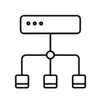
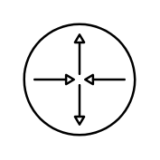
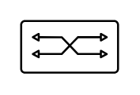

# Citrix Networking Entities

- [Bridge](./bridge.md)  

- [Dns](./dns.md)  

- [Firewall](./firewall.md)  

- [Internet](./internet.md)  

- [Network](./network.md)  

- [Router](./router.md)  

- [SdWan](./sd-wan.md)  

- [Switch](./switch.md)  

- [Tunnel](./tunnel.md)  

- [WifiRouter](./wifi-router.md)  

