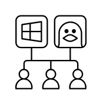

# Single and Multi-Session Windows and Linux Desktops

## Definition

```
{
  _style: { 
    entity: 'sketch=0;verticalLabelPosition=bottom;sketch=0;aspect=fixed;html=1;verticalAlign=top;strokeColor=none;fillColor=#000000;align=center;outlineConnect=0;pointerEvents=1;shape=mxgraph.citrix2.single_and_multi_session_windows_and_linux_desktops;',
  },
  _original_width: 48.85,
  _original_height: 50,
}
```

## Usage

```
import { SingleAndMultiSessionWindowsAndLinuxDesktops } from '@diac/standard-components-diagrams/citrixResources'

<SingleAndMultiSessionWindowsAndLinuxDesktops/>
```

## Preview


