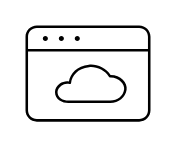

# Web / SaaS Apps

## Definition

```
{
  _style: 'sketch=0;verticalLabelPosition=bottom;sketch=0;aspect=fixed;html=1;verticalAlign=top;strokeColor=none;fillColor=#000000;align=center;outlineConnect=0;pointerEvents=1;shape=mxgraph.citrix2.web_saas_apps;',
  _width: 50,
  _height: 38.45,
}
```

## Usage

```
import { WebSaasApps } from '@reactiac/standard-components-diagrams/citrixResources'

<WebSaasApps/>
```

## Preview


