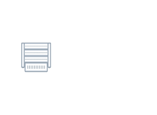
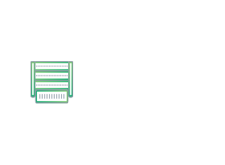
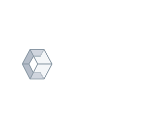

# Networking Cumulus Entities

- [AthensGray](./athens-gray.md)  

- [CadetBlue](./cadet-blue.md)  

- [ChassisBareMetalEmpty](./chassis-bare-metal-empty.md)  

- [ChassisCumulusLinux](./chassis-cumulus-linux.md)  

- [Container](./container.md)  

- [DdosServer](./ddos-server.md)  

- [EnergyJellow](./energy-jellow.md)  

- [Fern](./fern.md)  

- [GrayChateau](./gray-chateau.md)  

- [HalfBaked](./half-baked.md)  

- [Heather](./heather.md)  

- [Internet](./internet.md)  

- [Jade](./jade.md)  

- [LimedSpruce](./limed-spruce.md)  

- [LimitedSpruce](./limited-spruce.md)  

- [LinuxIcon](./linux-icon.md)  

- [Mantis](./mantis.md)  

- [NeonCarrot](./neon-carrot.md)  

- [NetqAgent](./netq-agent.md)  

- [NetqChassis](./netq-chassis.md)  

- [NetqIcon](./netq-icon.md)  

- [NetqServer](./netq-server.md)  

- [NetqTelemetryServer](./netq-telemetry-server.md)  

- [Nevada](./nevada.md)  

- [Observatory](./observatory.md)  

- [PackageDiagram](./package-diagram.md)  

- [PackageDiagram2](./package-diagram-2.md)  

- [RackBareMetal](./rack-bare-metal.md)  

- [RackCumulusLinux](./rack-cumulus-linux.md)  

- [RackOutOfBand](./rack-out-of-band.md)  

- [RackVoyager](./rack-voyager.md)  

- [RadicalRed](./radical-red.md)  

- [Rarity](./rarity.md)  

- [RollingStone](./rolling-stone.md)  

- [Seagull](./seagull.md)  

- [ServerBareMetal](./server-bare-metal.md)  

- [Switch](./switch.md)  

- [SwitchBareMetalEmpty](./switch-bare-metal-empty.md)  

- [SwitchCumulusLinux](./switch-cumulus-linux.md)  

- [SwitchOutOfBand](./switch-out-of-band.md)  

- [SwitchVoyager](./switch-voyager.md)  

