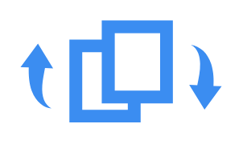

# Swap

## Definition

```
{
  _style: { 
    entity: 'sketch=0;html=1;aspect=fixed;strokeColor=none;shadow=0;fillColor=#3B8DF1;verticalAlign=top;labelPosition=center;verticalLabelPosition=bottom;shape=mxgraph.gcp2.swap',
  },
  _width: 100,
  _height: 51,
}
```

## Usage

```
import { Swap } from '@diac/standard-components-diagrams/gcp2GeneralIcons'

<Swap/>
```

## Preview


