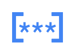

# Gcp2 Security Entities

- [Chronicle](./chronicle.md)  

- [CloudIam](./cloud-iam.md)  

- [CloudKeyManagement](./cloud-key-management.md)  

- [DataLossPreventionApi](./data-loss-prevention-api.md)  

- [ManagedMsAd](./managed-ms-ad.md)  

- [SecretManager](./secret-manager.md)  

- [SecurityCommandCenter](./security-command-center.md)  

- [SecurityKeyEnforcement](./security-key-enforcement.md)  

- [WebSecurityScanner](./web-security-scanner.md)  

