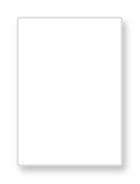

# Application

## Definition

```
{
  _style: 'fillColor=#ffffff;strokeColor=#dddddd;shadow=1;strokeWidth=1;rounded=1;absoluteArcSize=1;arcSize=2;labelPosition=center;verticalLabelPosition=middle;align=center;verticalAlign=bottom;spacingLeft=0;fontColor=#999999;fontSize=12;whiteSpace=wrap;spacingBottom=2;html=1;',
  _width: 0,
  _height: 85,
}
```

## Usage

```
import { Application } from '@reactiac/standard-components-diagrams/gcp2UserAndDeviceCards'

<Application/>
```

## Preview


