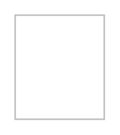

# Markers 3

## Definition

```
{
  _style: 'fillColor=#ffffff;strokeColor=#BDBDBD;strokeWidth=1;shadow=0;gradientColor=none;',
  _width: 0,
  _height: 70,
}
```

## Usage

```
import { Markers3 } from '@reactiac/standard-components-diagrams/gcp2Zones'

<Markers3/>
```

## Preview


