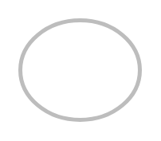

# Markers

## Definition

```
{
  _style: 'shape=ellipse;perimeter=ellipsePerimeter;fillColor=#ffffff;strokeColor=#BDBDBD;strokeWidth=2;shadow=0;gradientColor=none;fontColor=#757575;align=center;html=1;fontStyle=1;spacingTop=-1;',
  _width: 0,
  _height: 50,
}
```

## Usage

```
import { Markers } from '@diac/standard-components-diagrams/gcp2Zones'

<Markers/>
```

## Preview


