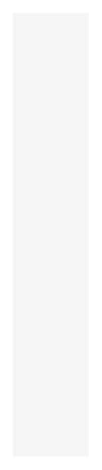

# Project Zone

## Definition

```
{
  _style: 'fillColor=#F6F6F6;strokeColor=none;shadow=0;gradientColor=none;fontSize=14;align=left;spacing=10;fontColor=#717171;9E9E9E;verticalAlign=top;spacingTop=-4;fontStyle=0;spacingLeft=40;html=1;whiteSpace=wrap;',
  _width: 0,
  _height: 350,
}
```

## Usage

```
import { ProjectZone } from '@diac/standard-components-diagrams/gcp2Zones'

<ProjectZone/>
```

## Preview


