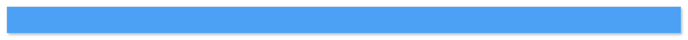

# Title bar

## Definition

```
{
  _style: { 
    entity: 'fillColor=#4DA1F5;strokeColor=none;shadow=1;gradientColor=none;fontSize=14;align=left;spacingLeft=50;fontColor=#ffffff;whiteSpace=wrap;html=1;',
  },
  _original_width: 1000,
  _original_height: 40,
}
```

## Usage

```
import { TitleBar } from '@dinghy/standard-components-diagrams/gcp2Zones'

<TitleBar/>
```

## Preview


