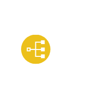

# Index App

## Definition

```
{
  _style: 'image;aspect=fixed;perimeter=ellipsePerimeter;html=1;align=center;shadow=0;dashed=0;fontColor=#4277BB;labelBackgroundColor=default;fontSize=12;spacingTop=3;image=img/lib/ibm/applications/index.svg;strokeColor=none;',
  _width: 60,
  _height: 60,
}
```

## Usage

```
import { IndexApp } from '@reactiac/standard-components-diagrams/ibmApplications'

<IndexApp/>
```

## Preview


