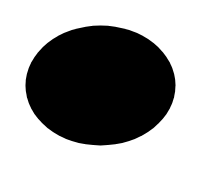

# User

## Definition

```
{
  _style: { 
    entity: 'shape=ellipse;fillColor=#000000;aspect=fixed;resizable=0;labelPosition=center;verticalLabelPosition=bottom;align=center;verticalAlign=top;strokeColor=none;fontSize=14;',
  },
  _width: 0,
  _height: 48,
}
```

## Usage

```
import { User } from '@diac/standard-components-diagrams/ibmCloudActors'

<User/>
```

## Preview


