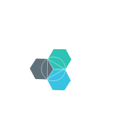
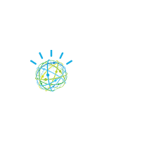

# Ibm Miscellaneous Entities

- [Bluemix](./bluemix.md)  

- [Cloudant](./cloudant.md)  

- [CognitiveServices](./cognitive-services.md)  

- [IbmContainers](./ibm-containers.md)  

- [IbmPublicCloud](./ibm-public-cloud.md)  

- [IotCloud](./iot-cloud.md)  

- [MicroservicesApplication](./microservices-application.md)  

- [ObjectStorage](./object-storage.md)  

- [OfflineCapabilities](./offline-capabilities.md)  

- [Openwhisk](./openwhisk.md)  

- [PeerCloud](./peer-cloud.md)  

- [RetrieveRank](./retrieve-rank.md)  

- [Scalable](./scalable.md)  

- [TextToSpeech](./text-to-speech.md)  

