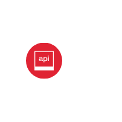

# API Security

## Definition

```
{
  _style: 'image;aspect=fixed;perimeter=ellipsePerimeter;html=1;align=center;shadow=0;dashed=0;fontColor=#4277BB;labelBackgroundColor=default;fontSize=12;spacingTop=3;image=img/lib/ibm/security/api_security.svg;strokeColor=none;',
  _width: 60,
  _height: 60,
}
```

## Usage

```
import { ApiSecurity } from '@diac/standard-components-diagrams/ibmSecurity'

<ApiSecurity/>
```

## Preview


