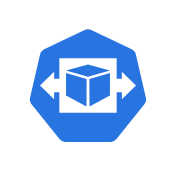
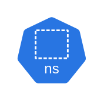

# Networking Kubernetes Entities

- [Api](./api.md)  

- [Api2](./api-2.md)  

- [CCM](./c-c-m.md)  

- [CCM2](./c-c-m-2.md)  

- [CM3](./c-m-3.md)  

- [CM4](./c-m-4.md)  

- [CRole](./c-role.md)  

- [CRole2](./c-role-2.md)  

- [Cm](./cm.md)  

- [Cm2](./cm-2.md)  

- [ControlPlane](./control-plane.md)  

- [ControlPlane2](./control-plane-2.md)  

- [Crb](./crb.md)  

- [Crb2](./crb-2.md)  

- [Crd](./crd.md)  

- [Crd2](./crd-2.md)  

- [Cronjob](./cronjob.md)  

- [Cronjob2](./cronjob-2.md)  

- [Deploy](./deploy.md)  

- [Deploy2](./deploy-2.md)  

- [Ds](./ds.md)  

- [Ds2](./ds-2.md)  

- [Ep](./ep.md)  

- [Ep2](./ep-2.md)  

- [Etcd](./etcd.md)  

- [Etcd2](./etcd-2.md)  

- [Group](./group.md)  

- [Group2](./group-2.md)  

- [Hpa](./hpa.md)  

- [Hpa2](./hpa-2.md)  

- [Ing](./ing.md)  

- [Ing2](./ing-2.md)  

- [Job](./job.md)  

- [Job2](./job-2.md)  

- [KProxy](./k-proxy.md)  

- [KProxy2](./k-proxy-2.md)  

- [Kubelet](./kubelet.md)  

- [Kubelet2](./kubelet-2.md)  

- [Limits](./limits.md)  

- [Limits2](./limits-2.md)  

- [Netpol](./netpol.md)  

- [Netpol2](./netpol-2.md)  

- [Node](./node.md)  

- [Node2](./node-2.md)  

- [Ns](./ns.md)  

- [Ns2](./ns-2.md)  

- [Pod](./pod.md)  

- [Pod2](./pod-2.md)  

- [Psp](./psp.md)  

- [Psp2](./psp-2.md)  

- [Pv](./pv.md)  

- [Pv2](./pv-2.md)  

- [Pvc](./pvc.md)  

- [Pvc2](./pvc-2.md)  

- [Quota](./quota.md)  

- [Quota2](./quota-2.md)  

- [Rb](./rb.md)  

- [Rb2](./rb-2.md)  

- [Role](./role.md)  

- [Role2](./role-2.md)  

- [Rs](./rs.md)  

- [Rs2](./rs-2.md)  

- [Sa](./sa.md)  

- [Sa2](./sa-2.md)  

- [Sc](./sc.md)  

- [Sc2](./sc-2.md)  

- [Sched](./sched.md)  

- [Sched2](./sched-2.md)  

- [Secret](./secret.md)  

- [Secret2](./secret-2.md)  

- [Sts](./sts.md)  

- [Sts2](./sts-2.md)  

- [Svc](./svc.md)  

- [Svc2](./svc-2.md)  

- [User](./user.md)  

- [User2](./user-2.md)  

- [Vol](./vol.md)  

- [Vol2](./vol-2.md)  

