# Network 2018 Entities

- [BiometricReader](./biometric-reader.md)  

- [Bus](./bus.md)  
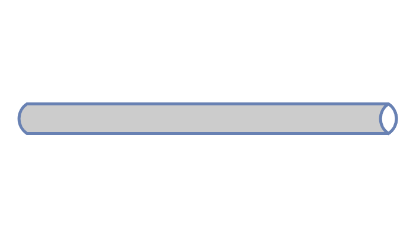

- [Bus2](./bus-2.md)  

- [Bus3](./bus-3.md)  

- [BusinessCenter](./business-center.md)  

- [Cloud](./cloud.md)  
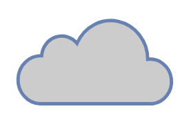

- [CommLinkIcon](./comm-link-icon.md)  
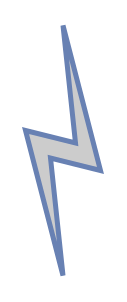

- [Community](./community.md)  
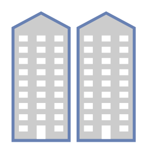

- [Copier](./copier.md)  

- [DesktopPc](./desktop-pc.md)  
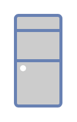

- [ExternalStorage](./external-storage.md)  
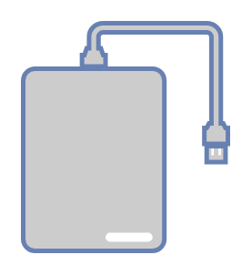

- [Firewall](./firewall.md)  
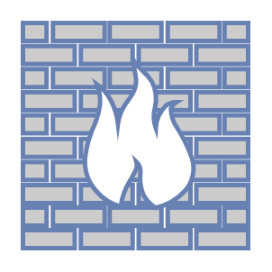

- [Gamepad](./gamepad.md)  

- [Hub](./hub.md)  
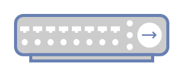

- [Laptop](./laptop.md)  
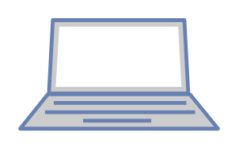

- [LoadBalancer](./load-balancer.md)  
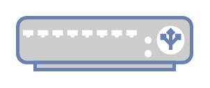

- [MailServer](./mail-server.md)  

- [Mainframe](./mainframe.md)  

- [Mobile](./mobile.md)  
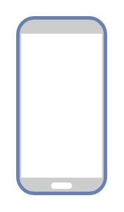

- [Modem](./modem.md)  

- [Monitor](./monitor.md)  
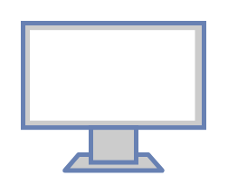

- [NasFiler](./nas-filer.md)  

- [PatchPanel](./patch-panel.md)  
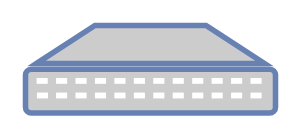

- [Pc](./pc.md)  

- [Phone](./phone.md)  
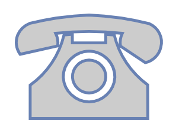

- [Phone2](./phone-2.md)  

- [Printer](./printer.md)  

- [ProxyServer](./proxy-server.md)  
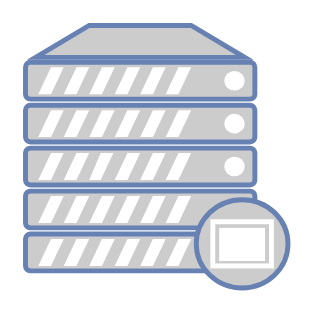

- [Rack](./rack.md)  
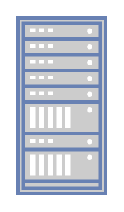

- [RadioTower](./radio-tower.md)  
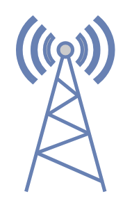

- [RingBus](./ring-bus.md)  

- [RingBus2](./ring-bus-2.md)  

- [Router](./router.md)  
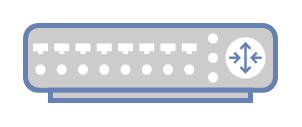

- [Satellite](./satellite.md)  
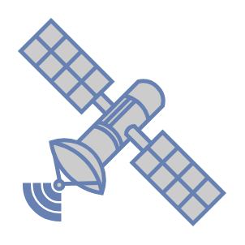

- [SatelliteDish](./satellite-dish.md)  
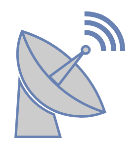

- [Scanner](./scanner.md)  
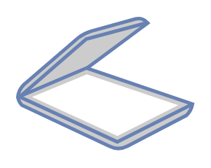

- [Secured](./secured.md)  

- [SecurityCamera](./security-camera.md)  
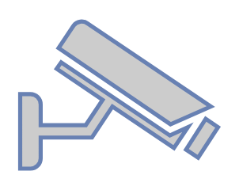

- [Server](./server.md)  
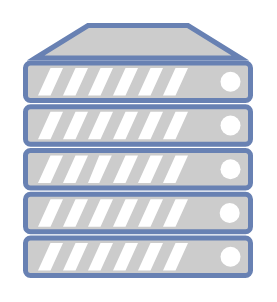

- [ServerStorage](./server-storage.md)  

- [Storage](./storage.md)  

- [Supercomputer](./supercomputer.md)  
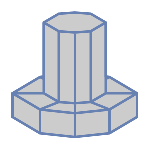

- [Switch](./switch.md)  
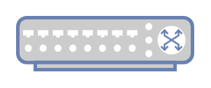

- [Tablet](./tablet.md)  
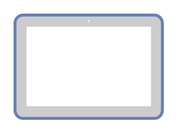

- [TapeStorage](./tape-storage.md)  
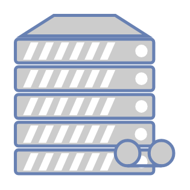

- [Terminal](./terminal.md)  
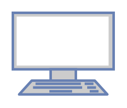

- [Unsecure](./unsecure.md)  

- [UpsEnterprise](./ups-enterprise.md)  
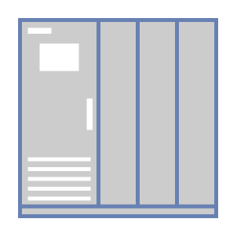

- [UpsSmall](./ups-small.md)  

- [UsbStick](./usb-stick.md)  
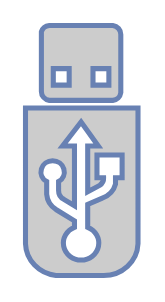

- [UserFemale](./user-female.md)  

- [UserMale](./user-male.md)  

- [Users](./users.md)  

- [VideoProjector](./video-projector.md)  

- [VideoProjectorScreen](./video-projector-screen.md)  
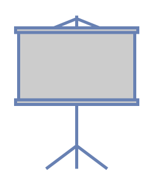

- [VirtualPc](./virtual-pc.md)  
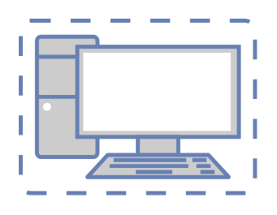

- [VirtualServer](./virtual-server.md)  
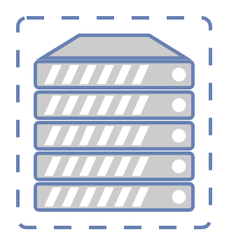

- [Virus](./virus.md)  
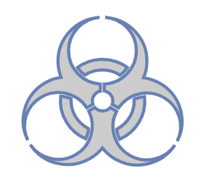

- [WebServer](./web-server.md)  
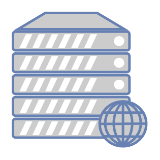

- [WirelessHub](./wireless-hub.md)  
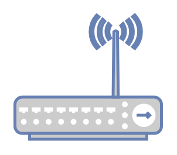

- [WirelessModem](./wireless-modem.md)  
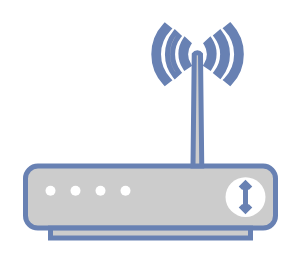
