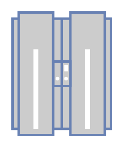

# Mainframe

## Definition

```
{
  _style: { 
    entity: 'fontColor=#0066CC;verticalAlign=top;verticalLabelPosition=bottom;labelPosition=center;align=center;html=1;outlineConnect=0;fillColor=#CCCCCC;strokeColor=#6881B3;gradientColor=none;gradientDirection=north;strokeWidth=2;shape=mxgraph.networks.mainframe;',
  },
  _original_width: 80,
  _original_height: 100,
}
```

## Usage

```
import { Mainframe } from '@dinghy/standard-components-diagrams/network'

<Mainframe/>
```

## Preview


