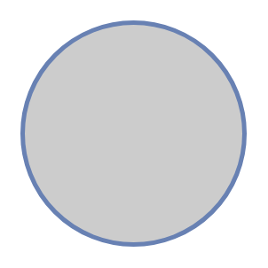

# Ring Bus

## Definition

```
{
  _style: { 
    entity: 'html=1;fillColor=#CCCCCC;strokeColor=#6881B3;shape=ellipse;perimeter=ellipsePerimeter;gradientColor=none;gradientDirection=north;fontColor=#ffffff;strokeWidth=2;',
  },
  _original_width: 100,
  _original_height: 100,
}
```

## Usage

```
import { RingBus } from '@diac/standard-components-diagrams/network'

<RingBus/>
```

## Preview


