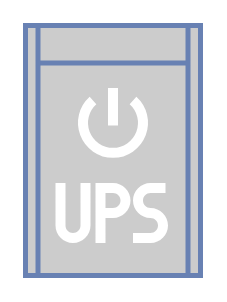

# UPS Small

## Definition

```
{
  _style: 'fontColor=#0066CC;verticalAlign=top;verticalLabelPosition=bottom;labelPosition=center;align=center;html=1;outlineConnect=0;fillColor=#CCCCCC;strokeColor=#6881B3;gradientColor=none;gradientDirection=north;strokeWidth=2;shape=mxgraph.networks.ups_small;',
  _width: 70,
  _height: 100,
}
```

## Usage

```
import { UpsSmall } from '@reactiac/standard-components-diagrams/network'

<UpsSmall/>
```

## Preview


