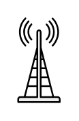

# Antenna

## Definition

```
{
  _style: 'shape=mxgraph.networks2.icon;aspect=fixed;fillColor=#EDEDED;strokeColor=#000000;gradientColor=#5B6163;network2IconShadow=1;network2bgFillColor=none;network2Icon=mxgraph.networks2.antenna;network2IconYOffset=0.0004;network2IconW=0.508;network2IconH=0.9997;',
  _width: 25.4,
  _height: 49.985,
}
```

## Usage

```
import { Antenna } from '@reactiac/standard-components-diagrams/network2'

<Antenna/>
```

## Preview


