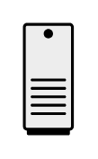

# Desktop PC

## Definition

```
{
  _style: { 
    entity: 'shape=mxgraph.networks2.icon;aspect=fixed;fillColor=#EDEDED;strokeColor=#000000;gradientColor=#5B6163;network2IconShadow=1;network2bgFillColor=none;network2Icon=mxgraph.networks2.desktop_pc;network2IconXOffset=-0.0034;network2IconYOffset=0.00035;network2IconW=0.453;network2IconH=0.9995;',
  },
  _original_width: 22.650000000000002,
  _original_height: 49.975,
}
```

## Usage

```
import { DesktopPc } from '@dinghy/standard-components-diagrams/network2'

<DesktopPc/>
```

## Preview


