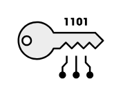

# Encryption

## Definition

```
{
  _style: { 
    entity: 'shape=mxgraph.networks2.icon;aspect=fixed;fillColor=#EDEDED;strokeColor=#000000;gradientColor=#5B6163;network2IconShadow=1;network2bgFillColor=none;network2Icon=mxgraph.networks2.encryption;network2IconXOffset=0.0006;network2IconYOffset=0.0881;network2IconW=1.0001;network2IconH=0.7019;',
  },
  _original_width: 50.005,
  _original_height: 35.095,
}
```

## Usage

```
import { Encryption } from '@dinghy/standard-components-diagrams/network2'

<Encryption/>
```

## Preview


