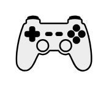

# Gamepad

## Definition

```
{
  _style: { 
    entity: 'shape=mxgraph.networks2.icon;aspect=fixed;fillColor=#EDEDED;strokeColor=#000000;gradientColor=#5B6163;network2IconShadow=1;network2bgFillColor=none;network2Icon=mxgraph.networks2.gamepad;network2IconXOffset=0.00005;network2IconYOffset=0.00163;network2IconW=1.0021;network2IconH=0.7358;',
  },
  _original_width: 50.105,
  _original_height: 36.79,
}
```

## Usage

```
import { Gamepad } from '@diac/standard-components-diagrams/network2'

<Gamepad/>
```

## Preview


