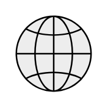

# Globe

## Definition

```
{
  _style: { 
    entity: 'shape=mxgraph.networks2.icon;aspect=fixed;fillColor=#EDEDED;strokeColor=#000000;gradientColor=#5B6163;network2IconShadow=1;network2bgFillColor=none;network2Icon=mxgraph.networks2.globe;network2IconW=1;network2IconH=1;',
  },
  _width: 60,
  _height: 60,
}
```

## Usage

```
import { Globe } from '@diac/standard-components-diagrams/network2'

<Globe/>
```

## Preview


