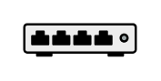

# Hub

## Definition

```
{
  _style: { 
    entity: 'fillColorStyles=neutralFill;neutralFill=#9DA6A8;shape=mxgraph.networks2.icon;aspect=fixed;fillColor=#EDEDED;strokeColor=#000000;gradientColor=#5B6163;network2IconShadow=1;network2bgFillColor=none;network2Icon=mxgraph.networks2.hub;network2IconXOffset=0.0001;network2IconYOffset=0.0129;network2IconW=1;network2IconH=0.2938;',
  },
  _width: 50,
  _height: 14.69,
}
```

## Usage

```
import { Hub } from '@diac/standard-components-diagrams/network2'

<Hub/>
```

## Preview


