# Network 2025 Entities

- [Antenna](./antenna.md)  

- [Application](./application.md)  
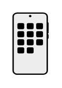

- [BigData](./big-data.md)  

- [Biohazard](./biohazard.md)  

- [BiometricReader](./biometric-reader.md)  

- [Cctv](./cctv.md)  

- [Cloud](./cloud.md)  

- [Community](./community.md)  

- [Copier](./copier.md)  

- [DataManagement](./data-management.md)  

- [DataStorage](./data-storage.md)  

- [DesktopPc](./desktop-pc.md)  

- [Encryption](./encryption.md)  

- [ExternalStorage](./external-storage.md)  
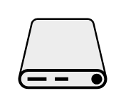

- [Firewall](./firewall.md)  

- [Gamepad](./gamepad.md)  

- [GlobalServer](./global-server.md)  

- [Globe](./globe.md)  

- [Hub](./hub.md)  

- [Internet](./internet.md)  

- [InternetSecurity](./internet-security.md)  

- [Lan](./lan.md)  

- [Laptop](./laptop.md)  

- [LoadBalancer](./load-balancer.md)  

- [Lock](./lock.md)  

- [MailServer](./mail-server.md)  

- [Mainframe](./mainframe.md)  
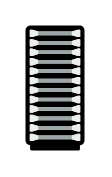

- [MobileNetwork](./mobile-network.md)  

- [MobilePhone](./mobile-phone.md)  
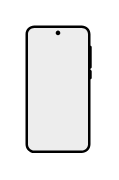

- [Modem](./modem.md)  

- [Monitor](./monitor.md)  
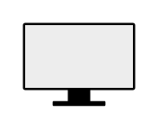

- [NasFiler](./nas-filer.md)  

- [Network](./network.md)  

- [NetworkSecurity](./network-security.md)  

- [PatchPanel](./patch-panel.md)  

- [Pc](./pc.md)  

- [Phone](./phone.md)  

- [Printer](./printer.md)  

- [ProjectorCanvas](./projector-canvas.md)  

- [RackCabinet](./rack-cabinet.md)  

- [Router](./router.md)  
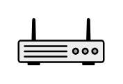

- [Satellite](./satellite.md)  

- [SatelliteDish](./satellite-dish.md)  

- [Scanner](./scanner.md)  
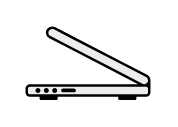

- [Server](./server.md)  
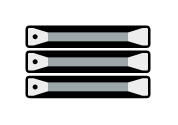

- [SocialMedia](./social-media.md)  

- [Tablet](./tablet.md)  

- [Terminal](./terminal.md)  
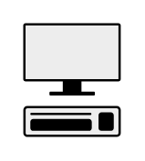

- [Threat](./threat.md)  

- [Ups](./ups.md)  
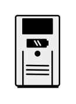

- [UserFemale](./user-female.md)  

- [UserMale](./user-male.md)  

- [Users](./users.md)  

- [VideoProjector](./video-projector.md)  

- [Vr](./vr.md)  

- [WebHosting](./web-hosting.md)  

- [WirelessHub](./wireless-hub.md)  
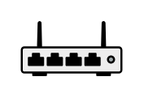
