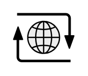

# Internet

## Definition

```
{
  _style: { 
    entity: 'shape=mxgraph.networks2.icon;aspect=fixed;fillColor=#EDEDED;strokeColor=#000000;gradientColor=#5B6163;network2IconShadow=1;network2bgFillColor=none;network2Icon=mxgraph.networks2.internet;network2IconXOffset=0.0012;network2IconYOffset=0.0035;network2IconW=0.9677;network2IconH=0.7722;',
  },
  _original_width: 48.385,
  _original_height: 38.61,
}
```

## Usage

```
import { Internet } from '@diac/standard-components-diagrams/network2'

<Internet/>
```

## Preview


