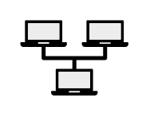

# LAN

## Definition

```
{
  _style: 'shape=mxgraph.networks2.icon;aspect=fixed;fillColor=#EDEDED;strokeColor=#000000;gradientColor=#5B6163;network2IconShadow=1;network2bgFillColor=none;network2Icon=mxgraph.networks2.lan;network2IconYOffset=0.0558;network2IconW=1.0834;network2IconH=0.7564;',
  _width: 54.169999999999995,
  _height: 37.82,
}
```

## Usage

```
import { Lan } from '@reactiac/standard-components-diagrams/network2'

<Lan/>
```

## Preview


